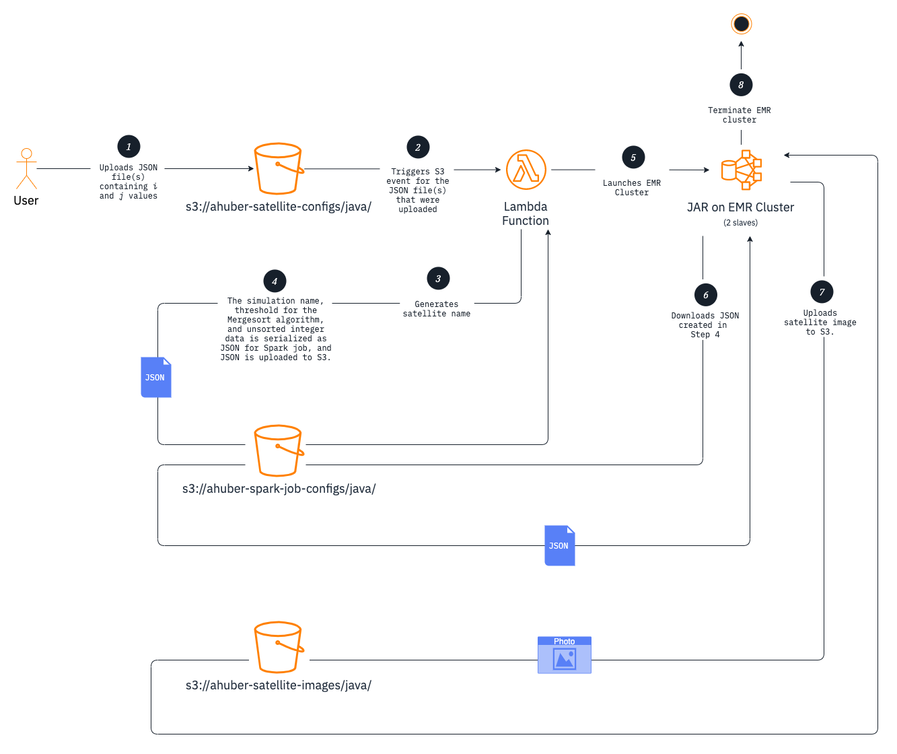

# Hubble Simulator (AWS Version) <!-- omit in toc -->

The original [Hubble Simulator project](https://github.com/ahuber1/Project5) was one of the programming projects I completed in college in 2014, When I was looking to start a Java project that uses AWS's services, I decided to replicate the original project while using as many AWS services as possible. Originally, this was intended to be a simple AWS Lambda function, but S3 and EMR were also incorporated. 

This README contains a version of the [original project description](https://github.com/ahuber1/Project5/blob/master/project05%20_1_.pdf), but has been modified when necessary to describe how the program runs using AWS's services.

- [Directory Structure](#directory-structure)
- [Project Overview](#project-overview)
  - [Objectives](#objectives)
  - [Primary Requirements](#primary-requirements)
  - [Amazon Web Services](#amazon-web-services)
    - [The Lambda function](#the-lambda-function)
    - [Sending Data for Processing](#sending-data-for-processing)

## Directory Structure

- ***HubbleUtils*** contains general-purpose utility functions, shared objects, and other shared logic between both the AWS Lambda function and the executable JAR that runs on the EMR cluster.
    ```
    cd HubbleUtils
    ./gradlew build
    ```
- ***HubbleLambda*** contains the AWS Lambda function. *HubbleUtils* is a dependency.
    ```
    cd HubbleLambda
    ./gradlew build
    ```
- ***HubbleSpark*** contains the code that will become the executable JAR that is executed on the EMR cluster. *HubbleUtils* is a dependency.
    ```
    cd HubbleSpark
    ./gradlew build
    ```

## Project Overview

Satellite telescopes gather a huge amount of data. Often satellites store their data in solid state memory and transfer it to Earth in batches. To prevent missing information, while satellites transfer data, the telescope continues to collect information. Once the information is received, the data is processed, sorted, and analyzed.

In this project students will be implementing a Hubble simulator that will (1) collect data, (2) transfer the data in batches, (3) sort and process the data stored in shared buffers, and (4) display the information for further analysis and verification.

### Objectives

The purpose of this project is to introduce the basic concepts of multi-threads, shared memory, synchronized methods, thread-safe operations, Java Fork/Join, visual illustrations of data, and AWS Lambda, EMR, and S3.

### Primary Requirements

Three concurrent threads will be in charge of _collecting_, _storing_, and _receiving_ the data before the data is sent to an EMR cluster for _processing_.

1. **Data collection:** the satellite thread will be generating and adding elements into a shared, thread-safe buffer *B<sub>1</sub>*. In this particular project, the satellite thread will produce random integers between 0 — 4096 every _randint(10, 200)_ milliseconds. If there is no space on the shared buffer *B<sub>1</sub>*, the satellite thread should wait.

2. **Shared Buffer:** the buffer thread creates and manages a thread-safe array *B<sub>1</sub>* of size  *N*<sup>2</sup> &times; 2, where *N* is a variable provided to each class. For this particular project, *N* = 2<sup><em>i</em></sup> for 8 &leq; i &leq; 11, thus there will be only four possible values for *N* &isin; {2<sup>8</sup> = 256, 2<sup>9</sup> = 512, 2<sup>10</sup> = 1024, 2<sup>11</sup> = 2048}

3. **Receiver:** the receiver thread will try to obtain data from the satellite through the shared buffer *B<sub>1</sub>*. However, the thread will have to wait until there are at least *N*<sup>2</sup> elements in the shared buffer. The buffer *B<sub>1</sub>* will notify the receiver when enough data becomes available and the receiver thread will then move the data into a different shared buffer *B<sub>2</sub>* of size *N*<sup>2</sup>. Once the data is transferred, the information should be removed from the satellite's buffer *B<sub>1</sub>*.

4. **Processing:** once the data has been processed, an EMR cluster comprising of one master node and two slave nodes should be launched _in your Java code_ that processes the data using Apache Spark. After completing the following steps or if any of the following steps fail, you _MUST_ shut down your EMR cluster.

    1. **Split the data into two halves.** Each half will go to one slave node.
   
    2. **Sort the elements.** Each slave node will sort its half using a _Fork/Join_ implementation of _Mergesort_. The Mergesort algorithm will receive a parameter *T* that defines the threshold for sorting the data. Each slave node will receive the same value for *T*. If the number of elements in a particular process are less than *T*, _insertion sort_ should be used to sort the elements. Otherwise, the data will be split and a _ForkingAction_ will be called. <br><br> The _Mergesort_ implementation does not have to be a generic class. Instead, it can be a similar implementation to the one discussed in class (see slides on Blackboard). The time *t*<sub>sec</sub> it takes to sort the elements should be computed. For this particular project, *T* = 10<sup><em>j</em></sup> where *j* &isin; {1, 2, 3, 4, 5}.
   
    3. **Merge the two halves.** Once the slave nodes sort each half of *B<sub>2</sub>*, merge them together into on sorted buffer *B<sub>3</sub>*.
    
    4. **Normalize the data.** Normalize the elements in *B<sub>3</sub>* between -128 and 127 and transfer the elements into a byte array.
   
    5. **Save the information into an image.** Once the byte array has been created, the data should be saved as a grayscale image. See documentation on `BufferedImage`, `ImageIO`, and `ByteArrayInputStream`.

    6. **Upload the image to Amazon S3.** 

### Amazon Web Services

There is not one program that performs all four steps that will execute in the simulation. Instead, the first three steps &mdash;_collecting_, _storing_, and _receiving_&mdash;will be performed inside an AWS Lambda function, and the final step, _processing_, will be performed in an executable JAR that will run on an EMR cluster. The Lambda function and executable JAR receive JSON file(s) as input: the Lambda function will receive the JSON file(s) through an S3 event and the JAR will receive a URI in the _s3://&lt;bucket&gt;/&lt;path&gt;/&lt;to&gt;/&lt;file&gt;_ that points to the JSON file created and uploaded by the Lambda function that requested the EMR cluster in the first place. The executable JAR also will have the responsibility of outputting the processed data into a greyscale image and uploading it to S3.

As you can see in the diagram below, which outlines the flow of data to and from the AWS Lambda function and the executable JAR, there are two files that are uploaded to S3 each time the simulation runs in its entirety in the AWS Lambda function and the EMR cluster (see Steps 4 and 7). In order to uniquely identify each simulation, the files should be named after the name of the simulation, which is in the
<u><b>&lt;<em>date</em>&gt;<code>_</code>&lt;<em>time</em>&gt;<code>i=</code>&lt;<em>i</em>&gt;<code>_j=</code>&lt;<em>j</em>&gt;</b></u> format where:

- ***&lt;date&gt;*** is the current date in GMT in the `yyyy-MM-dd` format.
- ***&lt;time&gt;*** is the current time of day in GMT in the `HH-mm-ss` format.
- ***&lt;i&gt;*** is the *i* value to use in the simulation.
- ***&lt;j&gt;*** is the *j* value to use in the simulation.

For example, if the current date and time is November 10, 2019 at 12:42 PM, and *i* and *j* equals 8 and 1, the name of the JSON file generated in Step 4 is `2019-11-10_12-42-00_i=8_j=1.json` and the name of the image in Step 7 is `2019-11-10_12-42-00_i=8_j=1.jpg`.



#### The Lambda function

The first three steps &mdash;_collecting_, _storing_, and _receiving_&mdash; should all occur inside a Lambda function. The Lambda function needs to respond to an S3 Event that is triggered when a JSON file is uploaded to the `ahuber-satellite-configs` bucket inside the `java` folder. This JSON follows the following schema:

```json
{
  "required": [
    "i",
    "j"
  ],
  "properties": {
    "i": {
      "type": "integer",
    },
    "j": {
      "type": "integer",
    }
  }
}
```

For example, the following JSON would be considered valid:

```json
{
    "i": 8,
    "j": 1
}
```

The _collecting_, _storing_, and _receiving_ steps should then run based on these values, which will, in turn, give you the value of *N* and *T* for the Hubble simulation.

#### Sending Data for Processing

Once the data has been received, an EMR cluster then needs to launch with a URI to an input JSON file as input. The URI should be in the _s3://&lt;bucket&gt;/&lt;path&gt;/&lt;to&gt;/&lt;file&gt;_ format. This JSON file should be stored in the `ahuber-spark-job-configs` bucket in the `java` folder. This JSON follows the following schema:

```json
{
  "required": [
    "satelliteName",
    "threshold",
    "data"
  ],
  "properties": {
    "satelliteName": {
      "type": "string"
    },
    "threshold": {
      "type": "integer"
    },
    "data": {
      "type": "array",
      "items": {
        "type": "integer",
      }
    }
  }
}
```

For example, the following JSON would be considered valid:

```json
{
    "satelliteName": "My Satellite",
    "threshold": 200,
    "data": [1, 2, 3]
}
```
